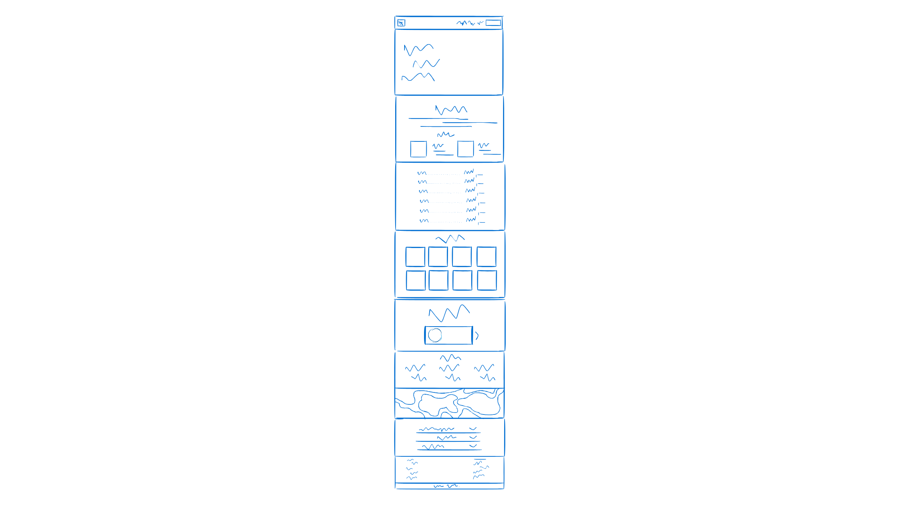

# Gentleman's Den

Gentleman's Den is a modern barbering website created as a seminar project in my third year of high school. The website is still a work in progress, and new features and improvements are being added.

## 🔗 Live Demo  
Check it out [here](https://kovarkrystof.github.io/gentlemens-den/)! 👀  

## 🛠 Technologies Used  
- **HTML**  
- **CSS**  
- **JavaScript**
- **Font Awesome**

## ✏️ Wireframe
- using **Canva**

You can check out the detailed project report [here](documentation.pdf).
